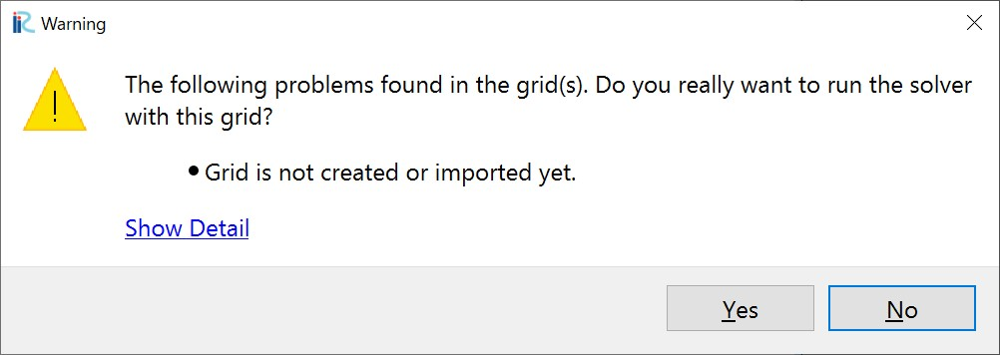
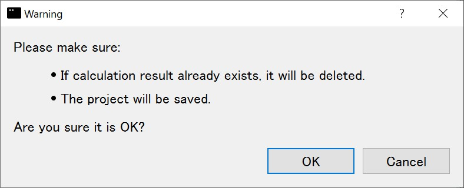
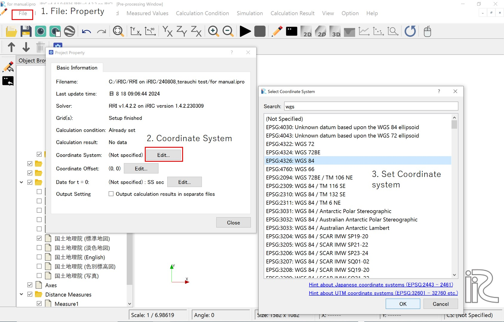
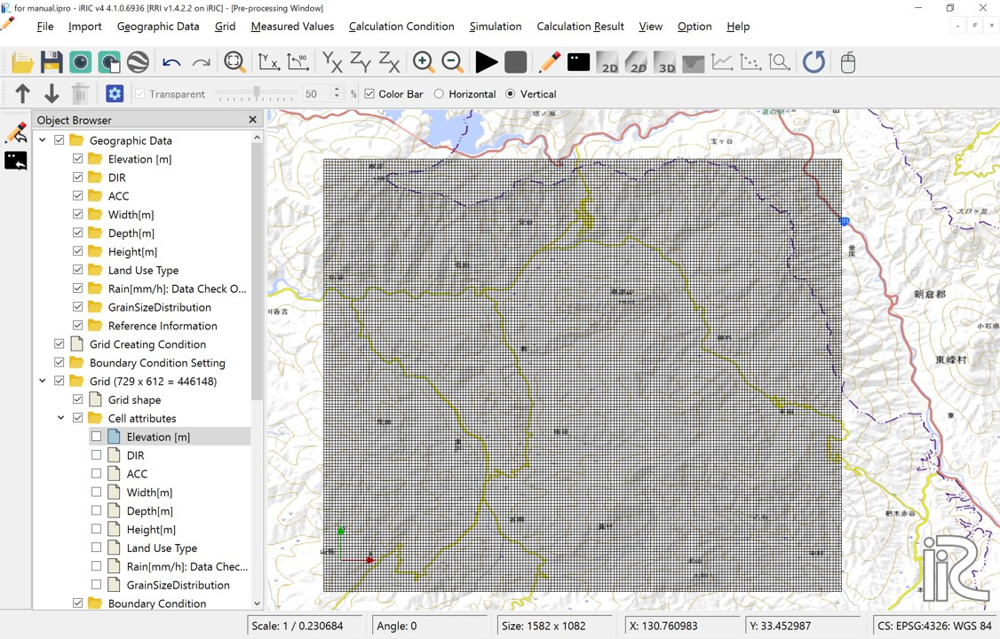
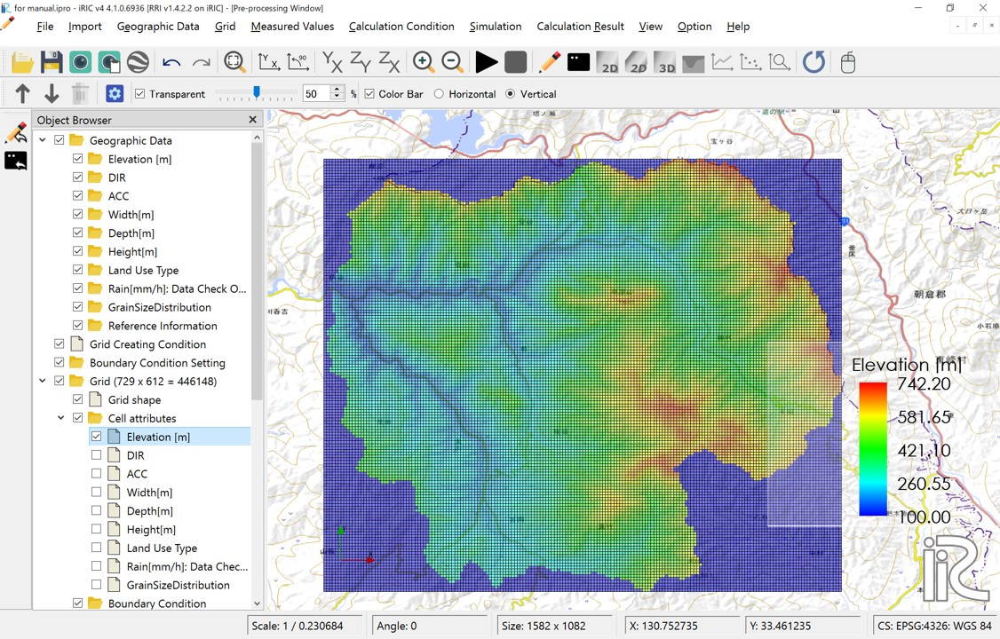
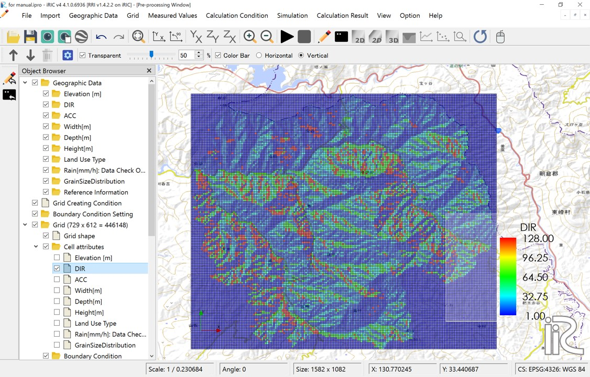
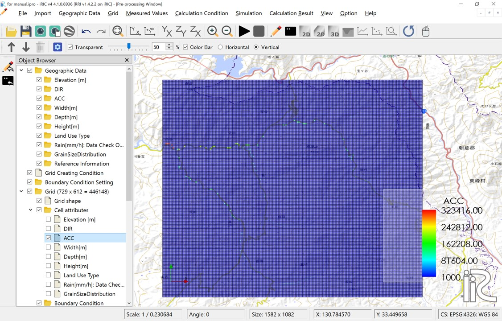
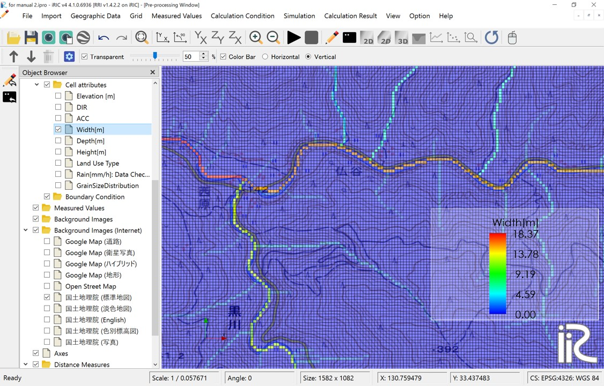
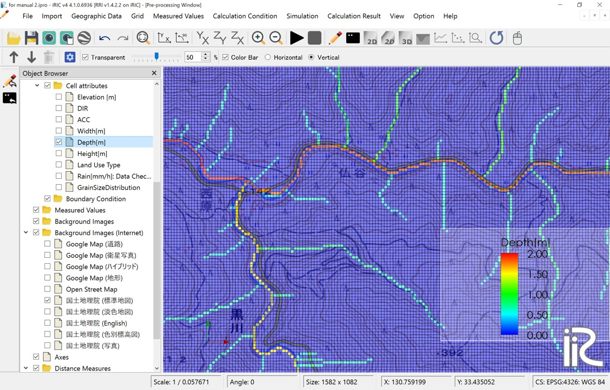

3. Set calculation conditions
~~~~~~~~~~~~~~~~~~~~~~~~~~~~~~

Launch the iRIC software and select "Rainfall-Runoff-Inundation v1.4.2.3" from "New Project."

RRI on iRIC primarily involves specifying and creating grid and grid attribute values through the "Calculation Conditions" menu.

Click on "Calculation Conditions > Settings."

3.1 Creating Grids and Grid Attributes
+++++++++++++++++++++++++++++++++++++++
In "RRI on iRIC," grids and grid attributes are created based on the values entered in the Basic Conditions group of the calculation conditions.

.. list-table:: Basic Conditions Group
   :widths: 70 30
   :header-rows: 1

   * - Screen
     - Condition
   * - .. image:: img/cond_1_en.jpg
     - | Runtype：
       |  Select 'Make Geographic Condition Only'

       | Geograpic Data file：
       | Specify the files downloaded in step 1
       |  - DEM: Hydrologically corrected elevation
       |  - Acc: Number of upstream drainage grids
       |  - Dir: Surface flow direction data

       | River Shape parameters：
       | Specify river channel parameters
       |  - River width: :math:`W = C_w A^{S_w}`
       |  - River depth: :math:`D = C_D A^{S_D}`
       |  - Levee: Levee height [m], Levee cell threshold

After setting these values, click the "OK" button.
Run the calculation by ckicking "Run" button. A warning will appear, but it is not an issue, so click "Yes."

A message recommending that you save the data before running the calculation will appear. Click "Yes."

Next, a screen will prompt you to choose a save method. Select "Save to file (ipro)" and click the "OK" button. Then, set an appropriate name and save the file.

.. figure:: img/save_type_en.jpg
   :scale: 50%
   :alt:

Data processing will begin, and the following window will be displayed. There are processes from STEP1 to STEP8 or 10.

.. figure:: img/rri_exe_console_en.jpg
   :scale: 60%
   :alt:

Once processing is complete, click the "OK" button and **save the project**.

-----

Once the above process is complete, you will be able to review the grids and grid attributes for the calculation. **Please reopen the file you saved earlier by selecting "File > Open."**

To review the grids and grid attributes, it is necessary to decignate the coordinate system. After setting your own coordinate, click 'OK'.

After setting the coordinate system, you will be able to review the grid shape and grid atteibutes.

   Grid system

   Cell attributes：Elavation[m]　DEM 

   Cell attributes：DIR　Flow direction; East(1),South-East(2),South(4),South-West(8),West(16),North-West(32),North(64),North-East(128)

   Cell attributes：ACC;　Number of upstream cells. Since cell size is set to be uniform for the entire basin, multiplying this value by the area per cell will give the upstream drainage area for that cell.

   
   Cell attributes：Width[m]　River width; Defined as :math:`W = C_w A^{S_w}` 

   Cell attributes：Depth[m] River depth; Defined as :math:`D = C_d A^{S_d}`

.. figure:: img/ini_height_en.jpg
   :scale: 50%
   :alt:

   Cell attributes：Levees are set in the red-colored locations.  
   Levees with the height specified by the levee height [m] are uniformly set in cells where the number of upstream drainage pixels exceeds the levee cell threshold.

----

3.2 Set rainfall conditions
++++++++++++++++++++++++++++++
The next step is to set the rainfall conditions.  
Prepare the rainfall data for the target region and period in the format described in "2. Preparation for a rainfall dataset".
Set the following values for the prepared data:

.. list-table:: Rainfall Data Settings
   :widths: 70 30
   :header-rows: 1

   * - Screen
     - Conditions
   * - .. image:: img/cond_2_en.jpg
     - | - Specify the rainfall data file
       | - Specify xllcorner_rain in longitude (radians)
       | - Specify yllcorner_rain in latitude (radians)
       | - Specify cellsize_rain_x as dx (radians)
       | - Specify cellsize_rain_y as dy (radians)

----

3.3 計算時間の設定
++++++++++++++++++++++++++++++
シミュレーションを行う時間数を指定します。
降雨データや境界データの時間数に関わらず、ここで設定する値で計算対象時間が決定されます。
斜面計算と河道計算のタイムステップは別々に指定することができます。
計算結果出力回数を指定します。初期値は除いて指定します。

.. list-table:: 降雨データの設定
   :widths: 70 30
   :header-rows: 1

   * - 画面
     - 条件
   * - .. image:: img/cond_3.jpg
     - | - シミュレーション時間(hour)
       | - 斜面計算タイムステップ(sec)
       | - 河道計算タイムステップ(sec)
       | - 計算結果出力回数（初期値出力はカウントしない）

----

3.4 河道シミュレーション設定
++++++++++++++++++++++++++++++
河道シミュレーションのパラメータは以下２つです。

- 河道セル判定閾値で指定した値よりも上流集水ピクセル数が大きいセルが河道となります。
- 河道セルと判定された箇所のマニング粗度係数を以下で指定できます。

.. list-table:: 河道シミュレーション設定
   :widths: 70 30
   :header-rows: 1

   * - 画面
     - 条件
   * - .. image:: img/cond_4.jpg
     - | - 河道マニング粗度係数
       | - 河道セル閾値

----

3.5 斜面シミュレーション設定
++++++++++++++++++++++++++++++
斜面シミュレーションのパラメータは、土地利用属性ごとに指定することができます。
土地利用属性は、格子属性として各セルに1から5まで（最大５種類）の値を設定することができます。
ここでは「オブジェクトブラウザ＞Land Use Type」を右クリック、インポートから「1.流域地形データセットの取得」でダウンロードした土地利用データ:ldu_export.ascをインポートします。
インポートが終了すると以下のように土地利用フラグにより、色付け表示されます。

.. figure:: img/geo_lnd.jpg
   :width: 420pt
   :alt:

   インポートした土地利用データ

インポートしたデータから格子属性：Land Use Typeを作成します。
「格子＞属性のマッピング」から「実行」をクリックすると、
マッピングする属性を指定する画面が表示されるので、「Land Use Type」を選択し、「OK」ボタンをクリックします。

.. figure:: img/select_attr.jpg
   :width: 210pt

   マッピング属性選択画面

マッピングが完了すると、
「格子＞セル属性＞Land Use Type」にチェック入れて、格子属性：Land Use Typeを確認することができるようになります。

.. figure:: img/ini_lnd.jpg
   :width: 420pt
   :alt:

   格子属性：Land Use Type

格子属性として各セルに設定した1から5の数値に応じたモデルパラメータ群を以下画面で指定します。

.. list-table:: 斜面シミュレーション設定
   :widths: 70 30
   :header-rows: 1

   * - 画面
     - 条件
   * - .. image:: img/cond_5.jpg
     - | - モデルパラメータについては
       | - `RRIのマニュアル <https://www.pwri.go.jp/icharm/research/rri/rri_top.html>`_ を参照ください。

----

3.6 ホットスタート
++++++++++++++++++++++++++++++
ホットスタートは、以前行った計算結果を初期値として計算を開始するような場合に利用します。
そのため出力と入力の設定があります。
出力設定では、ホットスタート用の出力を「行う/行わない」スイッチと、行う場合にはその出力先フォルダを指定します。出力先にはホットスタートの入力設定に必要なファイルが出力されます。
入力設定では、出力された斜面水深、河道水深、gampt_ffのファイルを指定しています。

.. list-table:: ホットスタート設定
   :widths: 70 30
   :header-rows: 1

   * - 画面
     - 条件
   * - .. image:: img/cond_8.jpg
     - | - ホットスタート設定

