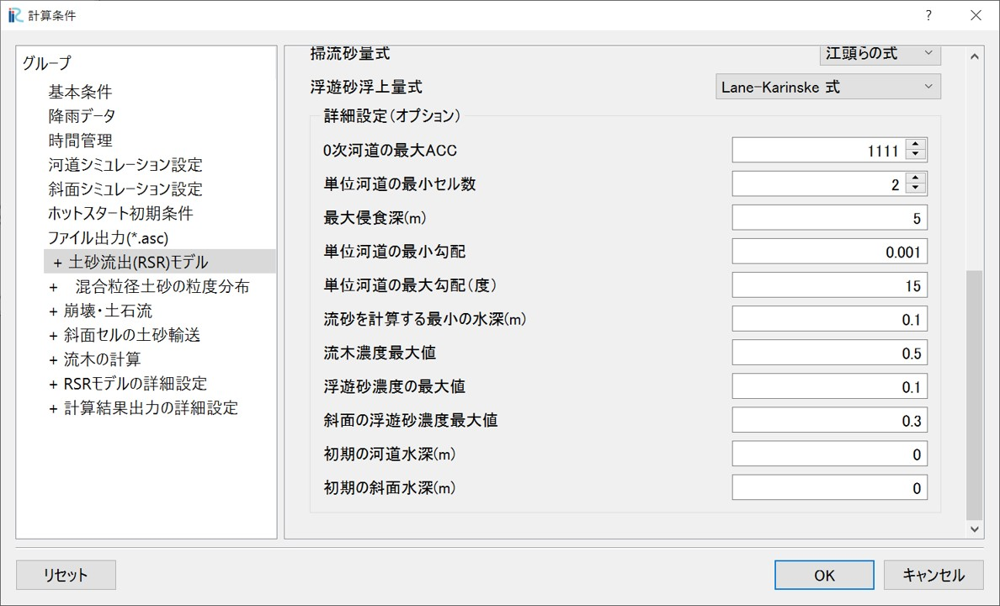

6. 降雨-土砂流出(RSR)モデル（オプション）
~~~~~~~~~~~~~~~~~~~~~~~~~~~~~~

6.1. 降雨-土砂流出(RSR)モデルの概要
--------------------------------------------------

RRIモデルで解析した斜面と河道の水理量に関する情報を用いて、単位河道モデルによって流域全体の水・土砂・流木の輸送を解析するモデルです。

.. figure:: img/RSR_scheme_1.jpg
   :scale: 60%
   :alt:

①河道への土砂供給（オプション）：

①-1：崩壊・土石流による土砂供給 [1]_ ,  [2]_ , ：斜面セルの水深の情報を用いて、流域内全ての斜面セルで斜面安定・不安定解析を行い、崩壊の発生を判定します。
斜面崩壊が起きた場合、質点系の方程式を用いて斜面の最急勾配方向へと崩土の移動を追跡します。その結果河道セルに土石流が到達すれば、河道に土砂が横流入したものとして扱います。
このモデルを用いる場合、斜面崩壊を評価できるよう、10~30mといった細かいメッシュを用いる必要があります。

①-2：斜面侵食による河道への土砂供給 [3]_ ,：斜面セルの水深の情報を用いて、浮遊砂浮上量式によって斜面の土砂侵食量を求めます。侵食された浮遊砂は斜面を移動して河道へと供給されます。

②河道の土砂輸送 [4]_ ,  [5]_ , ：

RRIモデルの河道セルで掃流砂と浮遊砂を計算することによって、流域全体の土砂輸送を解析します。
具体的には、合流点間を単位とする「単位河道」の平均的な水理量を用いて掃流砂・浮遊砂を評価して、単位河道を直列及び並列に配置することによって流域全体の土砂輸送を解析します。
本プログラムではセル一つ一つでの解析も可能ですが、計算の安定性の観点からあまり推奨しません。

③流木の輸送 [6]_ , ：

流域全体の流木の流出を解析するものです。①-1で崩壊・土石流を解析すれば、崩土の移動経路上にある立木は全て土石流に取り込まれ、土石流が河道に到達すれば、これを河道への横流入として評価します。
河道では移流方程式と貯留方程式を用いて、単位河道モデルによって流木の輸送を解析します。

.. [1] `Yamazaki, Y., Egashira, S., & Iwami, Y.: Method to Develop Critical Rainfall Conditions for Occurrences of Sediment-Induced Disasters and to Identify Areas Prone to Landslides, Journal of Disaster Research, 11(6), pp.1103-1111, 2016. <https://www.jstage.jst.go.jp/article/jdr/11/6/11_1103/_article/-char/en/>`_
.. [2] `山崎祐介, & 江頭進治. (2021). 豪雨にともなう洪水・土砂流出ハイドログラフの推定手法. 河川技術論文集, 27, 469-474. <https://www.jstage.jst.go.jp/article/river/27/0/27_PS2-42/_article/-char/ja/>`_
.. [3] `Qin, M., Harada, D., & Egashira, S. (2023). Influences of hillslope erosion on basin-scale sediment transport processes, proceedings of the 40th IAHR World Congress, August 2023. <https://www.iahr.org/library/infor?pid=29673>`_
.. [4] `Harada, D., & Egashira, S. (2024). Methods to create hazard maps for flood disasters with sediment and driftwood. Proceedings of IAHS, 386, 159-164. <https://piahs.copernicus.org/articles/386/159/2024/>`_
.. [5] `原田大輔, 江頭進治, 秦梦露. (2024). 降雨-土砂・流木流出モデルの特性-土砂粒度分布と流木の時空間変化に着目して. 河川技術論文集, 30, 335-340. <https://www.jstage.jst.go.jp/article/river/30/0/30_335/_article/-char/ja/>`_
.. [6] `Harada, D., & Egashira, S. (2023). Method to evaluate large-wood behavior in terms of the convection equation associated with sediment erosion and deposition. Earth Surface Dynamics, 11(6), 1183-1197. <https://esurf.copernicus.org/articles/11/1183/2023/esurf-11-1183-2023.html>`_

6.2. 計算条件の設定（基本条件） v17.23
--------------------------------------------------

降雨-土砂流出（RSR）モデルの基本的な計算条件について説明します。

.. figure:: img/RSR_cond_1.jpg
   :scale: 60%
   :alt:

- 土砂の解析(RSR)モデル：RSRモデルを用いる場合、「有効」を選択します。
- 河床変動の開始時刻(hour)：RRIモデルの計算開始後、これ以前の時間は、土砂の計算を行いません。
- 無次元限界掃流力：一様粒径を扱う場合に設定します。
- 均一粒径/混合粒径：均一粒径、混合粒径のどちらも選択可能です。
- 河床変動計算の時間刻み：RRIモデルの河道の計算時間間隔（デフォルトは60秒）に対する、土砂の計算の時間刻みを設定します。浮遊砂を扱う場合、時間刻みを細かく（この数字を大きく）した方が計算が安定します。
- 掃流砂量式：芦田・道上式、MPM式、江頭らの式、から選択可能です。
- 浮遊砂浮上量式：Lane-Kalinskeの式、Density stratified flow model、から選択可能です。
- その他のパラメータは一般的なものです。

詳細な計算条件設定（制約条件）について説明します。

- 単位河道の最小セル数：RSRモデルでは、RRIモデルで設定した河道セルの合流点を自動的に判別し、流域全体で単位河道を生成します。ただしあまりにも小さい単位河道が生成されれば計算が不安定になることがあるので、この値よりも小さいセルでの単位河道は生成しません。
- 最大侵食深(m)：初期の河床高に対して、この深さ以上の単位河道の侵食を許容せず、岩盤として扱います。
- 単位河道の最小勾配：掃流砂量式として江頭らの式を使う場合、交換層厚を動的に評価します。単位河道の河床勾配として、この値より勾配が緩い場合にこの値を採用します。
- 単位河道の最大勾配（度）：河道セルの勾配がこの値より大きい場合、その河道セルよりも上流側の河道セルは単位河道として設定しません。
- 流砂を計算する最小の水深(m)：単位河道の水深として、単位河道内の河道セルの水深の平均値を用います。水深がこの値より小さい場合に、流砂の計算を行いません。
- 
- 

