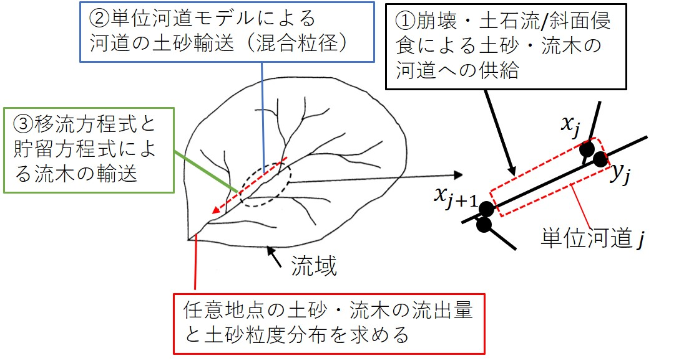

6. 降雨-土砂流出(RSR)モデル（オプション）
~~~~~~~~~~~~~~~~~~~~~~~~~~~~~~

6.1. 降雨-土砂流出(RSR)モデルの概要
--------------------------------------------------

RRIモデルで解析した斜面と河道の水理量に関する情報を用いて、単位河道モデルによって流域全体の水・土砂・流木の輸送を解析するモデルです。

①河道への土砂供給について：

①-1　崩壊・土石流による土砂供給[1]_ ,  [2]_ , ：斜面セルの水深の情報を用いて、流域内全ての斜面セルで斜面安定・不安定解析を行い、崩壊の発生を判定します。
斜面崩壊が起きた場合、質点系の方程式を用いて斜面の最急勾配方向へと崩土の移動を追跡します。その結果河道セルに土石流が到達すれば、河道に土砂が横流入したものとして扱います。
このモデルを用いる場合、斜面崩壊を評価できるよう、10~30mといった細かいメッシュを用いる必要があります。

①-2：斜面侵食による河道への土砂供給[3]_ ,：斜面セルの水深の情報を用いて、浮遊砂浮上量式によって斜面の土砂侵食量を求めます。侵食された浮遊砂は斜面を移動して河道へと供給されます。

RRIモデルの河道セルで、掃流砂と浮遊砂を計算することで、

.. [1] `Yamazaki, Y., Egashira, S., & Iwami, Y.: Method to Develop Critical Rainfall Conditions for Occurrences of Sediment-Induced Disasters and to Identify Areas Prone to Landslides, Journal of Disaster Research, 11(6), pp.1103-1111, 2016. <https://www.jstage.jst.go.jp/article/jdr/11/6/11_1103/_article/-char/en/>`_
.. [2] `山崎祐介, & 江頭進治. (2021). 豪雨にともなう洪水・土砂流出ハイドログラフの推定手法. 河川技術論文集, 27, 469-474. <https://www.jstage.jst.go.jp/article/river/27/0/27_PS2-42/_article/-char/ja/>`_
.. [3] `Qin, M., Harada, D., & Egashira, S. (2023). Influences of hillslope erosion on basin-scale sediment transport processes, proceedings of the 40th IAHR World Congress, August 2023. <https://www.iahr.org/library/infor?pid=29673>`_

.. figure:: img/cond_9.jpg
   :scale: 80%
   :alt:

「計算＞実行」をクリックすると計算が開始されます。

