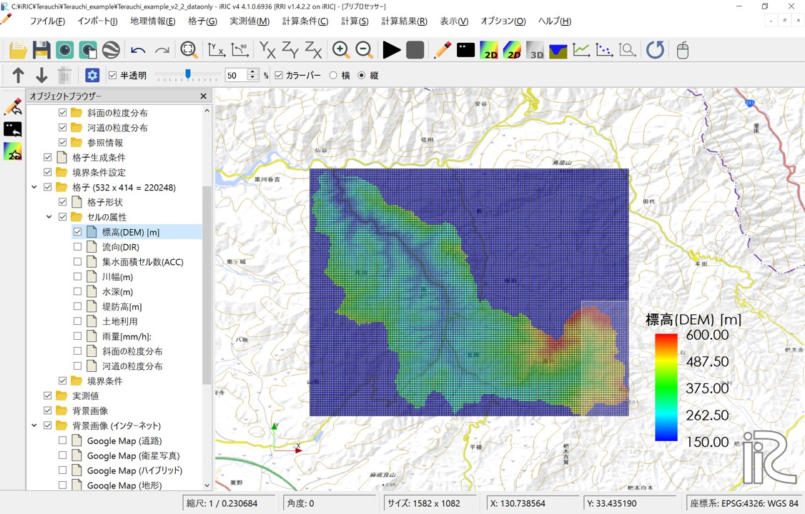
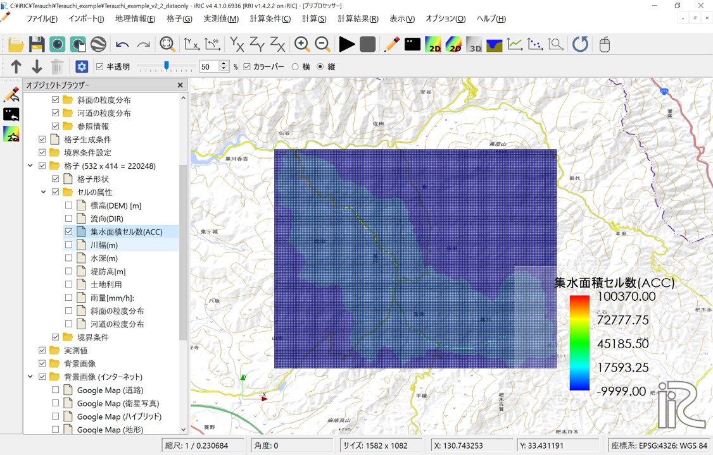
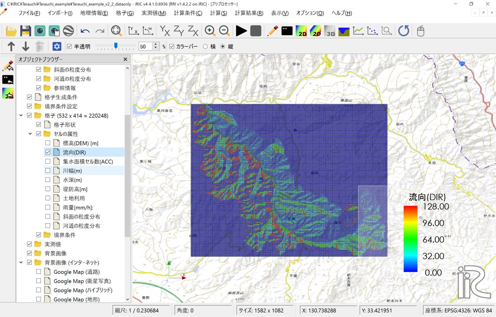
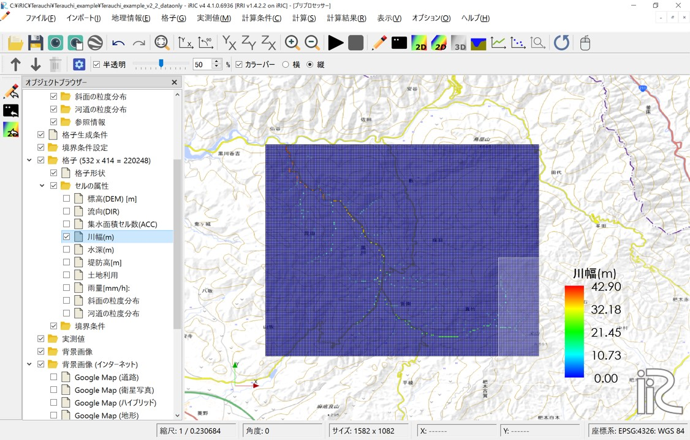
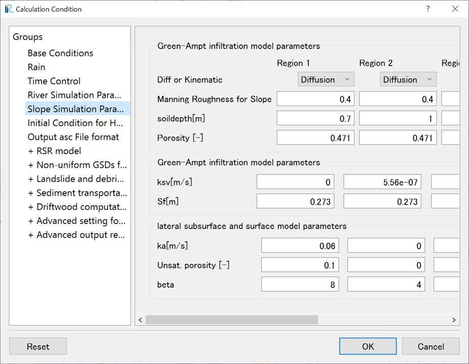

Example3：(RSR model) Kurokawa river, July 2017
==================================================
From July 5, 2017, heavy rainfall (the July 2017 Northern Kyushu Heavy Rain) caused numerous flood inundation with a large amount of sediment and driftwood in Asakura City, Fukuoka Prefecture, resulting in significant damage. 
This example demonstrates the procedure for applying the RSR model to the Terauchi Dam basin, located in the upper reaches of the Sada River, a tributary of the Chikugo River system, referencing the analysis results in [1]_.  (we apologize that the reference is in Japanese at this moment.).
This example alanlyze a sub-basin of the Sada River, the Kurokawa River basin (catchment area approximately 12.8 km²).

.. [1] `原田大輔, 江頭進治, 秦梦露. (2024). 降雨-土砂・流木流出モデルの特性-土砂粒度分布と流木の時空間変化に着目して. 河川技術論文集, 30, 335-340. <https://www.jstage.jst.go.jp/article/river/30/0/30_335/_article/-char/ja/>`_ 
-----

0. Sample data
--------------------------------------------------
The sample data used in this example can be downloaded from the following links:

- Terrain and rainfall dataset → data_2 (under Preparation)
- iRIC software project file → data_2_iRIC (under Preparation)
-----

１．Creating the Watershed Topographic Dataset
--------------------------------------------------
This analysis involves landslide and debris flow calculations, requiring the creation of a watershed topographic dataset using a fine mesh size, such as 10m. 
The watershed topographic dataset consists of elevation data (DEM), the number of accumulated upslope cells (ACC), and the flow direction (DIR), and the creation method is described in Chapter 3 of the RRI manual and elsewhere. 
The watershed topographic dataset for this example is included in the data downloadable from "0. Sample Data," and the creation method is as follows:

- [1] Within Japan, 10m mesh elevation data (DEM) can be downloaded from the Geospatial Information Authority of Japan's Fundamental Geospatial Data (Digital Elevation Model). You can also obtain high-resolution terrain data from `ASTER GDEM <https://www.jspacesystems.or.jp/ersdac/GDEM/E/1.html>`_
- [2] Using hydrological analysis tools such as Arc Hydro tools, perform filling (Fill DEM) on the DEM elevation data, then extract the watershed and create the number of accumulated upslope cells (ACC) and flow direction (DIR).
- [3] Store the created data (DEM, ACC, DIR) in a suitable location.
-----

２．Creating the Rainfall Dataset
--------------------------------------------------
The rainfall dataset is included in the "data_3/02_rain" folder of the data downloadable from "0. Sample Data". This folder contains processed rainfall data for the target area and period, extracted from analyzed rainfall data. 
For details on analyzed rainfall data, please refer to the  `Japan Meteorological Agency website <https://www.jma.go.jp/jma/kishou/know/kurashi/kaiseki.html#:~:text=%E8%A7%A3%E6%9E%90%E9%9B%A8%E9%87%8F%E3%81%A8%E9%80%9F%E5%A0%B1%E7%89%88,%E3%81%94%E3%81%A8%E3%81%AB%E4%BD%9C%E6%88%90%E3%81%95%E3%82%8C%E3%81%BE%E3%81%99%E3%80%82>`_

For this example, the file "rain.dat", which has already been converted to the RRI rainfall data format, is provided. 
Members of the iRIC-UC can create rainfall data files ("rain.dat") using `UC tools <https://tools.i-ric.info/login/>`.

-----

３．Calculation condition (Flow only)
--------------------------------------------------

3.1 Creating and Verifying the Grid and Grid Attributes
~~~~~~~~~~~~~~~~~~~~~~~~~~~~~~
Open the calculation condition setting screen from "Calculation Condition > Setting". Set the conditions as follows in the "Group > Base Conditions" section.

When performing sediment calculations, the channel width is an important parameter for evaluating bed shear stress, so set it to correspond to the actual conditions in the field. 
Also, in this calculation, the parameters related to channel depth (`Cd`) are set to large values to prevent the river channel from being completely filled with sediment.

.. list-table:: Base Conditions Group
   :widths: 80 20
   :header-rows: 1

   * - Screen
     - Condition
   * - .. image:: img_2/cond_1.jpg
     - | Execution Mode: "Make Geographic Condition Only"

       | Basic Parameters
       |  - Coordinate System: LatLon
       |  - Number of Flow Directions: 8

       | Data File Settings
       |  - DEM: filldem.txt
       |  - Acc: acc.txt
       |  - Dir: dir_kurokawa.txt

       | Channel Shape Parameters
       |  - :math:`C_w=12, S_w=0.5`
       |  - :math:`C_d=8, S_d=0.2`
       |  - Levee Height [m] = 0, Levee Cell Threshold = 500

Click "Save and Close", then click "Calculation > Run".

You may see the following warnings, but they can be ignored.

Click "Yes".
    .. image:: img_2/warning_nogrid.jpg
        :width: 480px
        :align: center

Click "OK".
    .. image:: img_2/warning_mapping2.jpg
        :width: 480px
        :align: center

Save the project in ipro format.
    .. image:: img_2/save_ipro.jpg
    :width: 480px
    :align: center

When data processing begins, the following screen will be displayed.
    .. image:: img_2/running2.jpg
        :width: 640px
        :align: center

When processing is complete, the following screen will be displayed.
    .. image:: img_2/end_run.jpg
    :width: 240px
    :align: center

Save the project and reopen it from "File > Open".

You can check the grid shape and the created cell attribute values in "Object Browser > Grid".

To display the map, set the coordinate system from "File > Propaty > Coordinate System" and select "WGS84" or a similar system. 

Check the "Cell Attributes" box to display each information type.

Grid Shape (532 × 414 = 220248)

Elevation (DEM) [m]: Elevation value of each cell.

Accumulated Cell Count (ACC): Number of upstream accumulated pixels for each cell. Multiplying this value by the cell area gives the upstream accumulation area (A).

Flow Direction (DIR): Flow direction for each cell. East(1), South-East(2), South(4), South-West(8), West(16), North-West(32), North(64), North-East(128).

Channel Width [m]: Channel width is set using the function  :math:`W = C_w A^{S_w}`, where A is the upstream accumulation area and the parameters are those specified.

Channel Depth [m]: Channel depth is set using the function :math:`D = C_d A^{S_d}`, where A is the upstream accumulation area and the parameters are those specified.

Other set parameters, such as Levee Height (m), can also be confirmed here. If you map land use, rainfall distribution set in 3.2, rainfall (mm/h), and grain size distribution (area) set on slopes and river channels as cell attributes, you can also check them here.

-----

3.2 Setting Rainfall 
~~~~~~~~~~~~~~~~~~~~~~~~~~~~~~
Use the "rain.dat" data file shown in "2. Creating the Rainfall Dataset" for the rainfall conditions.

Open the calculation condition setting screen from "Calculation Condition > Setting", select "Group > Rain", and set the following:

.. list-table:: Rainfall
   :widths: 70  30
   :header-rows: 1

   * - Screen
     - Condition
   * - .. image:: img_2/cond_2.jpg
     - | Rain file: Specify the "rain.dat" file
     - | downloaded as sample data.

     - | xllcorner_rain: 130
     - | yllcorner_rain: 33.33
     - | cellsize_rain_x: 0.0125
     - | cellsize_rain_y: 0.0083333

「計算条件＞設定」から計算条件設定画面を開きます。「グループ＞基本条件」で以下のように条件を設定します。

土砂の計算を行う場合、掃流力の評価において川幅が重要なパラメータとなるため、現地の状況と対応するように設定します。また、本計算では土砂の堆積によって河道が埋まらないよう、河道深さに関するパラメータ（Cd）を大きくしています。

.. list-table:: 基本条件グループ
   :widths: 80 20
   :header-rows: 1

   * - 画面
     - 条件
   * - .. image:: img_3/cond_1.jpg
     - | 実行モード：「格子・格子属性生成」

       | 基本パラメータ
       |  - 座標系: 緯度経度
       |  - 流向数: 8

       | データファイル設定
       |  - DEM: 水文補正標高(filldem)
       |  - Acc: 上流集水グリッド数
       |  - Dir: 表面流向データ

       | 河道形状パラメータ
       |  - :math:`C_w=12, S_w=0.5`
       |  - :math:`C_d=8, S_d=0.2`
       |  - 堤防高[m]=0, 堤防セル閾値=500

「保存して閉じる」をクリックし、「計算＞実行」をクリックします。
以下のような警告が表示されるかもしれませんが、問題ないので無視してください。

「いいえ」をクリックします。

１．流域地形データセットの取得
--------------------------------------------------
流域地形データセットは、「0.サンプルデータ」でダウンロードできるデータの中に入っていますが、以下の方法でも取得することができます。

- [1]  `「流域データ抽出」  <https://tools.i-ric.info/login/>`_    にアクセスします
- [2] ここでは1秒メッシュであるMERIT Hydroのデータをダウンロードします。
- [3] STEP1 球磨川流域を拡大し、対象流域の下流端をクリックします。

   .. image:: img_2/step1_click2.jpg
        :width: 640px

- [4] STEP2 「検索」ボタンをクリックすると、対象流域が抽出されます。

    .. image:: img_2/step2_extract2.jpg
        :width: 640px

- [5] STEP3 「取得」ボタンをクリックし、抽出されたデータを適当な場所にダウンロードしてください。

-----

２．降雨データセットの作成
--------------------------------------------------
降雨データセット、「0.サンプルデータ」ダウンロードできるデータの"data_2/02_rain"の中に対象地域の対象期間の解析雨量を切り出したデータを格納しています。
解析雨量については、 `気象庁のホームページ <https://www.jma.go.jp/jma/kishou/know/kurashi/kaiseki.html#:~:text=%E8%A7%A3%E6%9E%90%E9%9B%A8%E9%87%8F%E3%81%A8%E9%80%9F%E5%A0%B1%E7%89%88,%E3%81%94%E3%81%A8%E3%81%AB%E4%BD%9C%E6%88%90%E3%81%95%E3%82%8C%E3%81%BE%E3%81%99%E3%80%82>`_ をご確認ください。

ファイル名に含まれる時刻の降雨データがそれぞれASC形式のファイルに格納されています。時刻はUTCです。なおASC形式のデータはGISで可視化表示することができます。

"asc2raindat.py"はフォルダに含まれるASC形式の複数のデータから、RRI用の降雨データ形式のファイルを作成するPythonスクリプトです。
Python実行環境がある方はそれを利用してみてください。Python実行環境がなくても、すでにRRI用の降雨データ形式に変換したファイル"rain.dat"も一緒に格納しています。

-----

３．計算条件設定
--------------------------------------------------

3.1 格子・格子属性の作成・確認
~~~~~~~~~~~~~~~~~~~~~~~~~~~~~~
「計算条件＞設定」から計算条件設定画面を開きます。「グループ＞基本条件」で以下のように条件を設定します。

.. list-table:: 基本条件グループ
   :widths: 70 30
   :header-rows: 1

   * - 画面
     - 条件
   * - .. image:: img_2/cond_1.jpg
     - | モード：「格子・格子属性生成」
       
       | データファイル設定
       |  - DEM: 水文補正標高(elv_export.asc)
       |  - Acc: 上流集水グリッド数(upg_export.asc)
       |  - Dir: 表面流向データ(dir_export.asc)

       | 河道形状をパラメータ-
       |  - :math:`C_w=5, S_w=0.35`
       |  - :math:`C_d=0.95, S_d=0.2`
       |  - 堤防高[m]=2, 堤防セル閾値=1000

「保存して閉じる」をクリックし、「計算＞実行」をクリックします。

プロジェクトを保存し、「ファイル＞開く」から再度プロジェクトを開いてください。

「オブジェクトブラウザ＞格子」の格子形状、および、セル属性で作成された値を確認することができます。

格子形状（696×605=421080）
    .. image:: img_2/ini_grid.jpg
        :width: 640px
        :align: center

Elevation[m] 各セルの標高値です。
    .. image:: img_2/ini_elv.jpg
        :width: 640px
        :align: center

ACC　各セルの上流集水ピクセル数です。セル面積を乗じると上流集水面積:Aになります。
    .. image:: img_2/ini_acc.jpg
        :width: 640px
        :align: center

DIR　各セルの流向です。East(1),South-East(2),South(4),South-West(8),West(16),North-West(32),North(64),North-East(128)。
    .. image:: img_2/ini_dir.jpg
        :width: 640px
        :align: center

Width[m]　上流集水面積:Aと指定したパラメータによる関数 :math:`W = C_w A^{S_w}` で河道幅が設定されています。
    .. image:: img_2/ini_width.jpg
        :width: 640px
        :align: center

Depth[m]　上流集水面積:Aと指定したパラメータによる関数 :math:`D = C_d A^{S_d}` で河道深が設定されています。
    .. image:: img_2/ini_depth.jpg
        :width: 640px
        :align: center

Height[m]　上流集水ピクセル数が堤防セル閾値以上の箇所に、堤防高で指定された堤防が設定されています。
    .. image:: img_2/ini_height.jpg
        :width: 640px
        :align: center

-----

3.2 降雨条件の設定
~~~~~~~~~~~~~~~~~~~~~~~~~~~~~~
降雨条件は、「2.降雨データセットの作成」で示したデータ"rain.dat"を利用します。
"rain.dat"には、2020年7月3日 0:00UTCから2020年7月4日 3:00UTC（27時間分）の九州付近の降雨データが30分間隔で格納されています。
ASCファイルをテキストエディタで開くことで、データ詳細を確認することができます。

「計算条件＞設定」で計算条件設定画面を表示し、「グループ＞降雨データ」を選択し、以下のように設定します。

.. list-table:: 降雨データ　グループ
   :widths: 70 30
   :header-rows: 1

   * - 画面
     - 条件
   * - .. image:: img_2/cond_2.jpg
     - | 降雨データファイル：サンプルデータとして
       | ダウンロードした"rain.dat"を指定します。
       
       | xllcorner_rain:129
       | yllcorner_rain:30
       | cellsize_rain_x:0.0125
       | cellsize_rain_y:0.0083333

以上で降雨データを設定は完了です。

-----

3.3 計算時間の設定
~~~~~~~~~~~~~~~~~~~~~~~~~~~~~~
計算条件設定画面で、「グループ＞時間管理」を選択し、以下のように設定します。

.. list-table:: 時間管理　グループ
   :widths: 70 30
   :header-rows: 1

   * - 画面
     - 条件
   * - .. image:: img_2/cond_3.jpg
     - | シミュレーション時間[hour]：27
       | 斜面計算タイムステップ[sec]：600
       | 河道計算タイムステップ[sec]：60
       | 出力回数：27

-----

3.4 河道シミュレーション設定
~~~~~~~~~~~~~~~~~~~~~~~~~~~~~~
ここでは、河道セルの判定値と河道セルと認識されたセルのマニング粗度係数を指定します。

.. list-table:: 河道シミュレーション　グループ
   :widths: 70 30
   :header-rows: 1

   * - 画面
     - 条件
   * - .. image:: img_2/cond_4.jpg
     - | 河道のマニング粗度係数：0.03
       | 河道セル判定閾値：100

-----

3.5 斜面シミュレーション設定
~~~~~~~~~~~~~~~~~~~~~~~~~~~~~~
斜面シミュレーションは、セル属性"Land Use Type"と関連してパラメータ設定を行います。
まずダウンロードした地形データセットの"ldu_export.asc"を利用して、セル属性を設定します。

「オブジェクトブラウザー＞Land Use Type」、インポートをクリックし、ラスタデータを選択します。
"ldu_export.asc"を選択し、「開く」をクリックします。
座標系を指定する画面が表示されるので「OK」をクリックし、"EPSG:4326: WGS84"を指定し「OK」をクリックします。

.. image:: img_2/ldu_coordinates.jpg
        :width: 360px
        :align: center

インポートすると以下のようにデータを確認することができます。

本土地利用区分データは佐山氏らが参考値として作成したもので、なんら正確性が保証されたものではありません。
が、本事例ではこのデータを利用して計算することにします。

.. image:: img_2/ldu_import.jpg
        :width: 640px
        :align: center

各領域の土地利用区分は以下のようです。

============== ==========================================
Region           土地利用区分
============== ==========================================
Region1         水田
Region2         畑地
Region3         山地
Region4         都市
Region5         水域
============== ==========================================

ここまでの操作では、「地理情報」に土地利用データを読み込んだに過ぎず、計算に利用される格子属性としての土地利用データが作成されていません。
「格子＞属性マッピング＞実行」をクリックします。マッピング属性を選択する画面が表示されます。
"Land Use Type"のみを選択し、「OK」ボタンをクリックしてください。

.. image:: img_2/mapping.jpg
        :width: 240px
        :align: center

.. note::
    マッピング処理は、地理情報から格子属性を作成する処理になります。
    「オブジェクトブラウザ＞地理情報」下に読み込まれているデータが、格子形状に応じてマッピングされます。
    逆に、「オブジェクトブラウザ＞地理情報」下に何もデータが読み込まれていない場合は、既存格子属性がすべて削除されます。

マッピングが完了すると、「格子＞セル属性＞Land Use Type」をチェックすることで格子属性を確認することができます。

.. image:: img_2/ldu_grid_attr.jpg
        :width: 640px
        :align: center

計算条件設定画面で「グループ＞斜面シミュレーション設定」を選択します。
1から5の土地利用区分を踏まえ、地下浸透、地下水流れに係るパラメータを以下のように設定します。
Region1からResion5すべてのパラメータが有効になります。

-----

４．計算実行
--------------------------------------------------
計算条件画面で、「基本条件」の実行モードを「計算実行」にします。
「保存して閉じる」で、計算条件設定画面を閉じます。

.. image:: img_2/cond_0.jpg
        :width: 480px
        :align: center

「計算＞実行」から計算を実行してください。
計算実行前には必ず、データを保存してください。
計算が開始されると以下の画面が表示されます。

.. image:: img_2/calc_status.jpg
        :width: 640px
        :align: center

計算が終了すると、終了を知らせる画面が表示されます。

-----

５．計算結果分析・可視化
--------------------------------------------------
計算が正常に終了すると、可視化ウィンドウの表示が可能となります。
RRI on iRICは以下の値を計算結果として出力しています。

============== ========================================== ======
表示名            意味                                      補足
============== ========================================== ======
total_qp_t[mm]  総雨量[mm]                                  1
qp_t[mm/h]      雨量強度[mm/h]                              1
hs[m]           氾濫原水深[m]                               1
hr[m]           河道水深[m]                                 1 
qr[m]           河道流量[m3/s]                              1
qu              斜面流量x方向[m/s]                          1
qv              斜面流量y方向[m/s]                          1
hg[m]           地下水深[m]                                 1
gu              地下流量x方向[m/s]                          1
gv              地下流量y方向[m/s]                          1
gampt_ff        Green-Ampt cumulative water depth [m]      1
============== ========================================== ======

iRICソフトウェアの基本機能を利用して、様々な角度から計算結果を確認することができます。
以下に可視化例を表示します。

流域総雨量：2020年7月3日 0:00-4日 3:00UTC（2020年7月3日 9:00-4日 12:00JST)の27時間でに700mm以上降った箇所が複数地点あることが確認できます
    .. image:: img_2/res_sum_rain.png
        :width: 640px
        :align: center

氾濫被害が生じた人吉地区 紅取橋付近の河道流出流量（i=219, j=169)　ピーク流量は800m3/s程度であったという結果でした。
    .. image:: img_2/res_runoff.png
        :width: 640px
        :align: center

ピーク時（2020年7月4日 10:00時）の河道水深と斜面水深
    .. image:: img_2/res_depth.png
        :width: 640px
        :align: center

ピーク時（2020年7月4日 10:00時）の河道水深と斜面水深　市街地部分を拡大。市街地部分で氾濫が生じている様子が確認できます。
    .. image:: img_2/res_depth_2.png
        :width: 640px
        :align: center

-----

まとめ
--------------------------------------------------
ここではRRI on iRICの使い方として、地形と降雨データを準備、それらを計算条件として設定し、計算を実行し、計算結果を可視化、確認する流れを紹介しました。
得られた計算結果と実現象との比較は、ここでは行いません。各自実践してみてください。
必要に応じて、パラメータを調整し再計算するなどして、現象に対する理解を深めていただければと思います。

